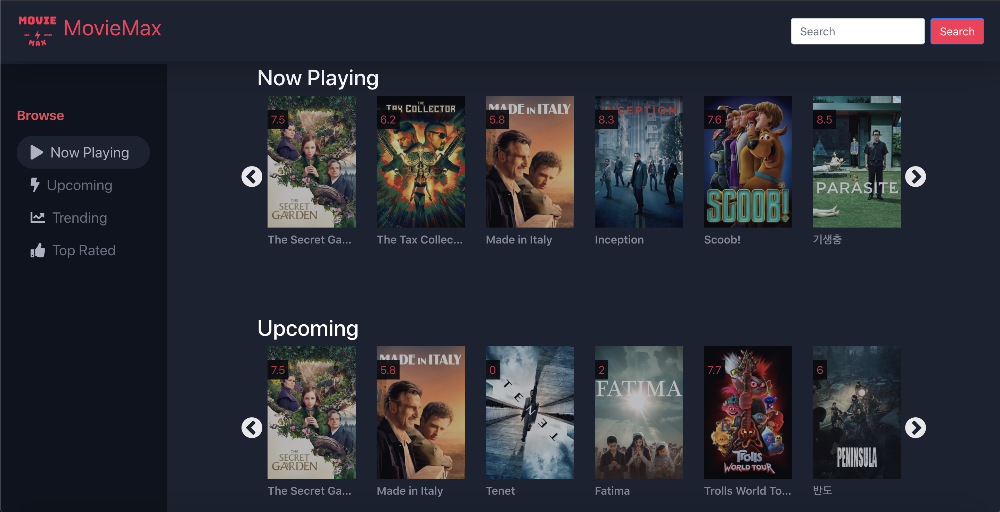

<br />
<p align="center">
    <a href="#">
        
    </a>
    <h2 align="center">Movie Max</h3>
    <p align="center">
        Browse your favorite movies, actors, and watch trailers. See what is playing in theaters right now. Discover upcoming, trending, and top-rated titles.
        <br />
        <br />
        <a href="#">View Demo</a>
        ·
        <a href="https://github.com/luisg5/movie-max/issues">Report Bug</a>
        ·
        <a href="https://github.com/luisg5/movie-max/issues">Request Feature</a>
    </p>
</p>

### Table of Contents

- [About the Project](#about-the-project)
  - [Built Using](#built-using)
- [Getting Started](#getting-started)
  - [Pre-requisites](#pre-requisites)
  - [Installation](#installation)
- [Contributing](#contributing)
- [License](#license)
- [Contact](#contact)
- [Acknowldegements](#acknowldegements)

## About the Project



This single-page application takes advantage of The Movie DB API to show various movies ranging from now playing in theatres, upcoming, trending, top-rating, and much more.

### Built Using

- [The Movie DB (API)](https://themoviedb.org)
- [React](https://reactjs.org)
  - [React Router](https://reactrouter.com)
  - [React Bootstrap](https://react-bootstrap.github.io)

## Getting Started

To get a local copy up and running follow these simple example steps.

### Pre-requisites

1. Get a free API Key at [The Movie Database (TMDB)](https://www.themoviedb.org)

### Installation

1. Clone the repo

```
git clone https://github.com/luisg5/movie-max.git
```

2. Install NPM packages.

```
npm install
```

1. Enter your `API Read Access Token (v4 auth)` in [.env](.env)

## Contributing

Contributions are what make the open source community such an amazing place to be learn, inspire, and create. Any contributions are greatly appreciated.

1. Fork the Project
2. Create your Feature Branch (git checkout -b feature/CoolFeature)
3. Commit your Changes (git commit -m 'Add some CoolFeature)
4. Push to the Branch (git push origin feature/CoolFeature)
5. Open a Pull Request

## License

Distributed under the MIT License. See `LICENSE` for more information.

## Contact

Luis Garcia - lgarc15@outlook.com

Project link: https://github.com/luisg5/movie-max

## Acknowldegements

- [React Slick](https://react-slick.neostack.com)
- [React Animate](https://github.com/digital-flowers/react-animated-css)

